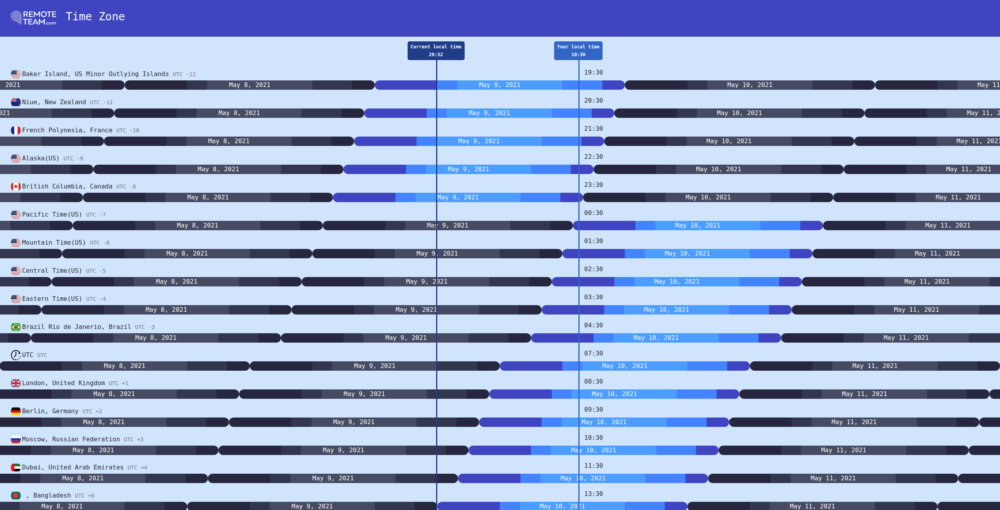

# rt-every-timezone

> A project to compare the time zone at your location with the other time zones.

## Build Setup

``` bash
# install dependencies
npm install

# serve with hot reload at localhost:8080
npm run dev

# build for production with minification
npm run build
```

<h1>Screenshot From Project</h1>

